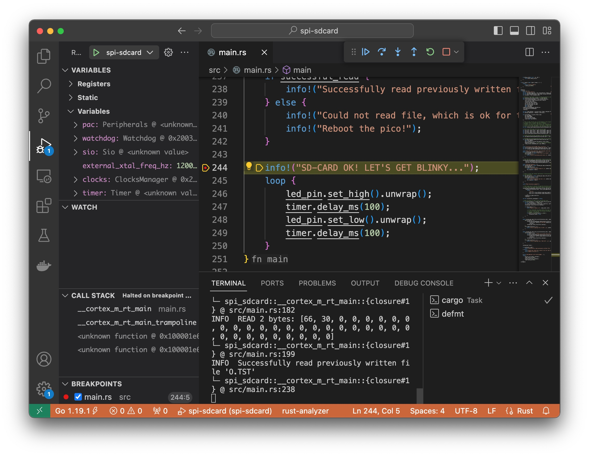

# RP2040 Pico + SPI SD-Card + Debug Probe

This project accesses an SD-card using a SPI serial bus.

The project runner uses `probe-rs` to flash an RP2040 `pico` board via a `RPI Debug Probe` (CMSIS-DAP probe).

VS-Code and the `Debugger for probe-rs` extension is used to flash the `pico` and debug using breakpoints.

The rp2040-hal-template project was used as a starting point for this project.

# Debug Probe

The `Raspberry Pi Debug Probe` is the CMSIS-DAP probe used by `probe-rs` for this project:
* https://www.raspberrypi.com/documentation/microcontrollers/debug-probe.html

The probe performs the following functions:
1. Flashes the built image to the `pico` board
1. Debugs the running executable with breakpoints

# Requirements

- The standard Rust tooling (cargo, rustup) which you can install from https://rustup.rs/
- Toolchain support for the cortex-m0+ processors in the rp2040 (thumbv6m-none-eabi)
- flip-link - this allows you to detect stack-overflows on the first core, which is the only supported target for now.
- (by default) A [`probe-rs` installation](https://probe.rs/docs/getting-started/installation/)
- A [`probe-rs` compatible](https://probe.rs/docs/getting-started/probe-setup/) probe

  You can use a second
  [Pico as a CMSIS-DAP debug probe](debug_probes.md#raspberry-pi-pico). Details
  on other supported debug probes can be found in
  [debug_probes.md](debug_probes.md)

# Dev Dependencies

```sh
rustup target install thumbv6m-none-eabi
cargo install flip-link
# Installs the probe-rs tools, including probe-rs run, our recommended default runner
cargo install probe-rs --features=cli --locked
# If you want to use elf2uf2-rs instead, do...
cargo install elf2uf2-rs --locked
```

# Running
  
For a debug build
```sh
cargo run
```
For a release build
```sh
cargo run --release
```

If you do not specify a DEFMT_LOG level, it will be set to `debug`.
That means `println!("")`, `info!("")` and `debug!("")` statements will be printed.
If you wish to override this, you can change it in `.cargo/config.toml` 
```toml
[env]
DEFMT_LOG = "off"
```

You can also set this inline (on Linux/MacOS)  
```sh
DEFMT_LOG=trace cargo run
```

or set the _environment variable_ so that it applies to every `cargo run` call that follows:
#### Linux/MacOS/unix
```sh
export DEFMT_LOG=trace
```

Setting the DEFMT_LOG level for the current session  
for bash
```sh
export DEFMT_LOG=trace
```

#### Windows
Windows users can only override DEFMT_LOG through `config.toml`
or by setting the environment variable as a separate step before calling `cargo run`
- cmd
```cmd
set DEFMT_LOG=trace
```
- powershell
```ps1
$Env:DEFMT_LOG = trace
```

```cmd
cargo run
```

# Debugging

VS-Code and the `Debugger for probe-rs` extension can be used to flash the image and debug using breakpoints:

